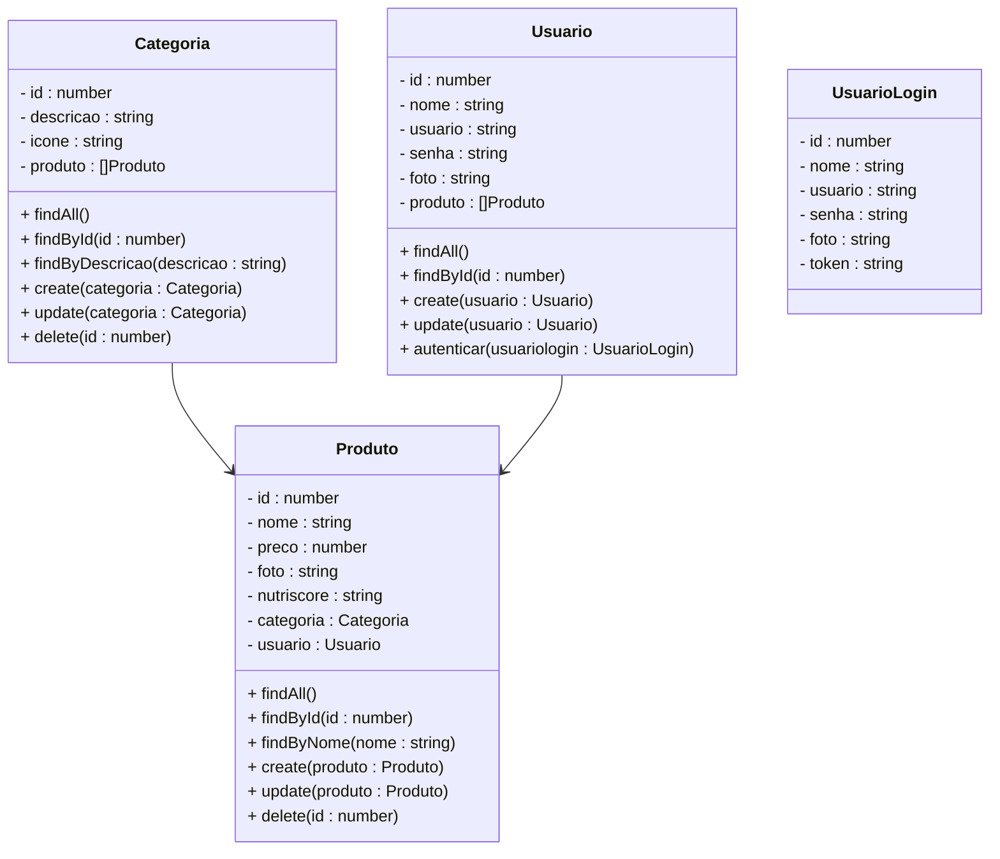
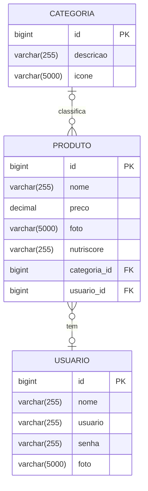

# Projeto Delivery de Alimentos - Backend

 

    

  

## 1. Descrição

Um sistema de **delivery de alimentos saudáveis** permite que os usuários solicitem refeições de restaurantes parceiros, garantindo opções balanceadas e informativas para uma alimentação mais saudável. Geralmente, estas plataformas oferecem as seguintes funcionalidades

1. Um catálogo de restaurantes e pratos disponíveis
2. Funcionalidade de busca e filtragem de opções
3. Sistema de pedidos e pagamentos online
4. Avaliações e feedback dos usuários
5. Entre outros recursos

No caso de um sistema focado em alimentos saudáveis é fundamental incluir:

- Informações nutricionais
- Opções para dietas específicas (vegana, sem glúten, low-carb, etc.)
- Recomendações personalizadas baseadas nas preferências e necessidades do usuário

 

## 2. Sobre esta API

A API foi desenvolvida utilizando o Framework **NestJS**, oferecendo endpoints para gerenciamento dos **usuários, dos produtos e das categorias alimentares**, além de recomendações de pratos saudáveis baseadas nos macro nutrientes.

### Principais funcionalidades:

1. Cadastro e gerenciamento de usuários
2. Registro e gerenciamento de categorias
3. Criação e gerenciamento de produtos
4. Indicação de produtos saudáveis utilizando o modelo **NutriScore**

 

## 3. Indicação de Alimentos Saudáveis - NutriScore

O **NutriScore** é um sistema de classificação nutricional que avalia alimentos de acordo com sua qualidade nutricional, utilizando uma escala de **A (verde escuro - mais saudável) a E (vermelho - menos saudável)**, como vemos na imagem abaixo:

    

A classificação é baseada nos **nutrientes bons e ruins** por 100g do alimento:

- **Bons:** fibras, proteínas, frutas, legumes e oleaginosas
- **Ruins:** calorias, açúcares, gorduras saturadas e sódio

O sistema atribui pontos a cada critério, calculando a classificação final do alimento.

 

## 4. Integração com a API - Google Gemini

O **Google Gemini** é uma família de modelos de inteligência artificial (IA) desenvolvida pelo Google DeepMind. Ele é projetado para processar múltiplos tipos de dados (texto, imagem, áudio e código) e pode ser utilizado em diversas aplicações, como assistentes virtuais, geração de texto, análise de imagens e mais.

A API do **Google Gemini** será utilizada para obter as informações nutricionais dos alimentos no momento do cadastro e atualização dos dados dos produtos. Isso permitirá que os usuários recebam dados precisos e confiáveis.

### Passos para integração:

1. Criar um projeto no [Google Cloud Console](https://console.cloud.google.com)
2. Criar um novo projeto
3. Ativar a **API do Gemini** e gerar uma **chave de API**
4. Adicionar a chave de API e a URL nas variáveis de ambiente do projeto Nest
5. **URL da API do Gemini:** https://generativelanguage.googleapis.com/v1beta/models/gemini-1.5-flash-latest:generateContent
6. Criar um serviço para consumir a API do Gemini, através do envio de requisições HTTP

 

## 5. Diagrama de Classes

 

## 6. Diagrama Entidade-Relacionamento (DER)

 

## 7. Tecnologias utilizadas

| Item                          | Descrição  |
| ----------------------------- | ---------- |
| **Servidor**                  | Node JS    |
| **Linguagem de programação**  | TypeScript |
| **Framework**                 | Nest JS    |
| **ORM**                       | TypeORM    |
| **Banco de dados Relacional** | MySQL      |

 

## 8. Configuração e Execução

1. Clone o repositório
2. Instale as dependências: `npm install`
3. Configure o banco de dados no arquivo `app.module.ts`
4. Configure as variaveis de ambiente no arquivo `.env`
5. Execute a aplicação: `npm run start:dev`

 

## 9. Implementações Futuras

- [ ] Implementar a função Curtir produtos

