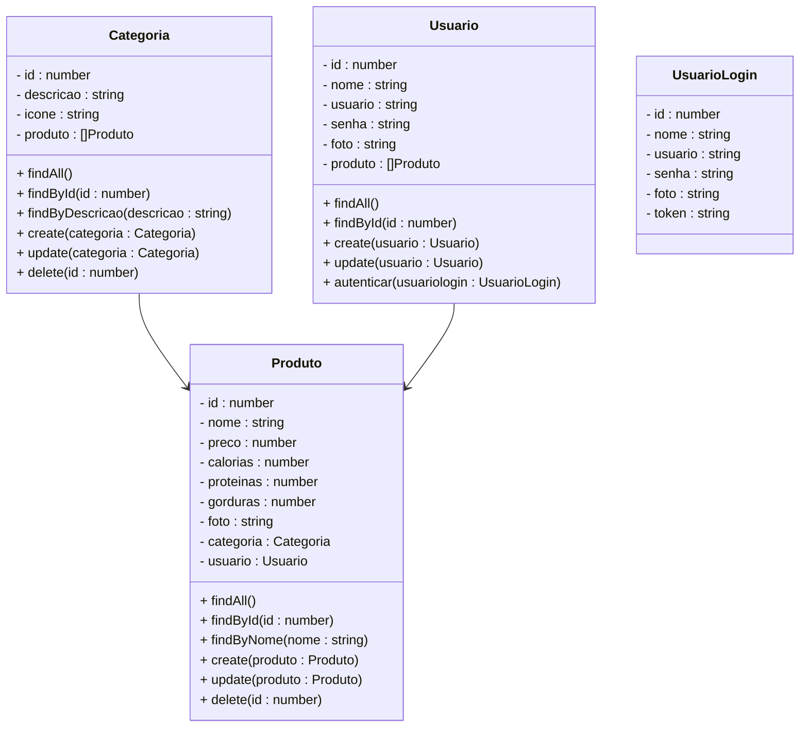

# Projeto Delivery de Alimentos

 

    

  

## 1. O que é um Sistema de Delivery de Alimentos?

Um sistema de delivery de alimentos é uma plataforma digital que permite aos usuários pedirem comida de restaurantes ou estabelecimentos parceiros e terem a refeição entregue em sua localização. Estes sistemas geralmente incluem:

1. Um catálogo de restaurantes e pratos disponíveis
2. Funcionalidade de busca e filtragem de opções
3. Sistema de pedidos e pagamentos online
4. Rastreamento de entrega
5. Avaliações e feedback dos usuários

No caso de um sistema focado em alimentos saudáveis, há um ênfase adicional em:

- Informações nutricionais detalhadas
- Opções para dietas específicas (vegana, sem glúten, low-carb, etc.)
- Recomendações personalizadas baseadas nas preferências e necessidades do usuário

 

## 2. Sobre esta API

Esta API foi desenvolvida utilizando NestJS para criar a estrutura básica de um sistema de delivery de alimentos saudáveis. Ela fornece endpoints para gerenciar usuários, pratos e categorias alimentares, além de oferecer recomendações de pratos saudáveis com base nos macro nutrientes.

>Os macro nutrientes são nutrientes que o corpo humano precisa em grandes quantidades para funcionar normalmente, e devem constituir a maior parte da dieta. São eles: Carboidratos, Proteínas, Gorduras.

### 2.1. Principais Funcionalidades

1. Cadastro e gerenciamento de usuários
2. Registro e gerenciamento de categorias
3. Criação e gerenciamento de produtos
4. Indicação de produtos saudáveis

### 2.2. Indicação de Alimentos Saudáveis

Para definir se um alimento é saudável, é importante considerar os valores de **calorias** e **proteínas** de acordo com as necessidades nutricionais diárias recomendadas, que podem variar dependendo de fatores como idade, gênero, nível de atividade física e objetivos de saúde. No entanto, algumas diretrizes gerais ajudam a criar um equilíbrio entre esses macro nutrientes.

#### Diretrizes Gerais para um Prato Saudável:

1. **Calorias**:
   - Um prato saudável geralmente tem entre **300 a 500 calorias**, dependendo do total diário de ingestão recomendado (normalmente entre 1.800 a 2.500 calorias por dia).
2. **Proteínas**:
   - Para um prato equilibrado, a porção de proteínas deve variar entre **20 a 35 gramas** por refeição.

  

## 3. Diagrama de Classes

**Observações Importantes:**

- O método **findSaudavel** deve atender a alguns requisitos:
  - Receber os parâmetros do tipo number **calorias e proteínas**
  - As calorias devem ser expressas em **quilocalorias (Kcal)**
  - As proteínas devem ser expressas em **gramas (g)**
  - Os critérios para determinar se uma alimentos é saudável serão os seguintes:
    - *Calorias <= 500*
    - *Proteínas >= 20*
  - O resultado final deve ser expresso em horas e minutos

  

## 4. Diagrama Entidade-Relacionamento (DER)

    

  

## 5. Tecnologias utilizadas

| Item                          | Descrição  |
| ----------------------------- | ---------- |
| **Servidor**                  | Node JS    |
| **Linguagem de programação**  | TypeScript |
| **Framework**                 | Nest JS    |
| **ORM**                       | TypeORM    |
| **Banco de dados Relacional** | MySQL      |

  

## 6. Configuração e Execução

1. Clone o repositório
2. Instale as dependências: `npm install`
3. Configure o banco de dados no arquivo `app.module.ts`
4. Execute a aplicação: `npm run start:dev`