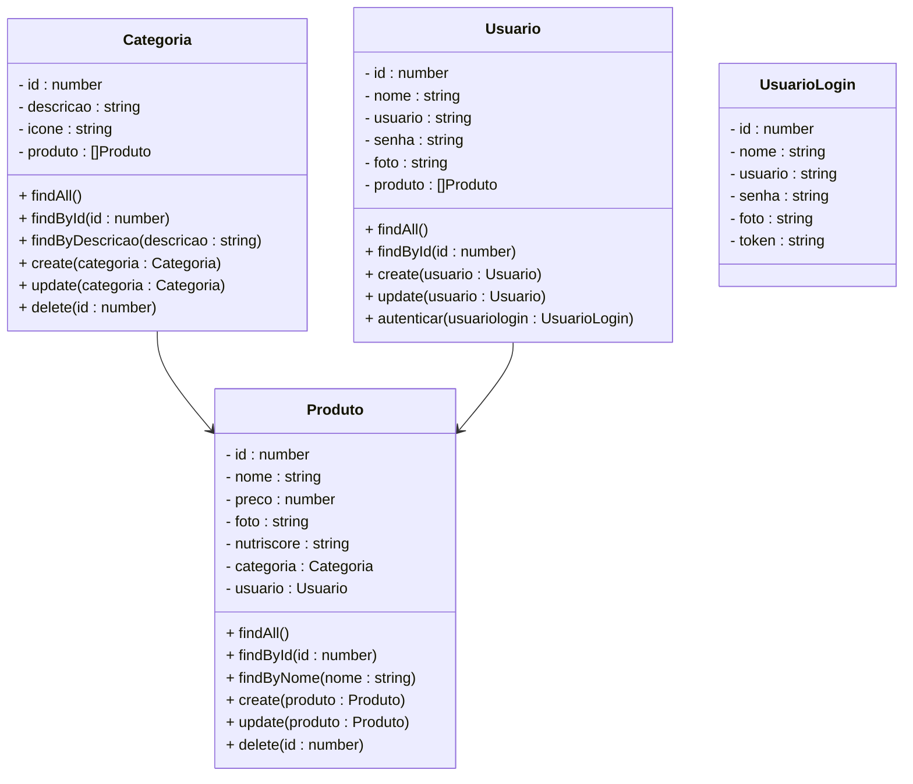
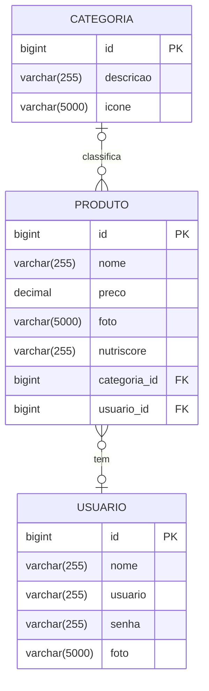

# Projeto Delivery de Alimentos - Backend

<br />

<div align="center">
    
</div>
<br /><br />

## 1. Descrição

Um sistema de **delivery de alimentos saudáveis** permite que os usuários solicitem refeições de restaurantes parceiros, garantindo opções balanceadas e informativas para uma alimentação mais saudável. Geralmente, estas plataformas oferecem as seguintes funcionalidades

1. Um catálogo de restaurantes e pratos disponíveis
2. Funcionalidade de busca e filtragem de opções
3. Sistema de pedidos e pagamentos online
4. Avaliações e feedback dos usuários
5. Entre outros recursos

No caso de um sistema focado em alimentos saudáveis é fundamental incluir:

- Informações nutricionais
- Opções para dietas específicas (vegana, sem glúten, low-carb, etc.)
- Recomendações personalizadas baseadas nas preferências e necessidades do usuário

<br />

## 2. Sobre esta API


A API foi desenvolvida utilizando o Framework **NestJS**, oferecendo endpoints para gerenciamento dos **usuários, dos produtos e das categorias alimentares**, além de recomendações de pratos saudáveis baseadas nos macro nutrientes.


### Principais funcionalidades:

1. Cadastro e gerenciamento de usuários
2. Registro e gerenciamento de categorias
3. Criação e gerenciamento de produtos
4. Indicação de produtos saudáveis utilizando o modelo **NutriScore**

<br />

## 3. Indicação de Alimentos Saudáveis - NutriScore


O **NutriScore** é um sistema de classificação nutricional que avalia alimentos de acordo com sua qualidade nutricional, utilizando uma escala de **A (verde escuro - mais saudável) a E (vermelho - menos saudável)**, como vemos na imagem abaixo:

<div align="center">
    
</div>

A classificação é baseada nos **nutrientes bons e ruins** por 100g do alimento:

- **Bons:** fibras, proteínas, frutas, legumes e oleaginosas
- **Ruins:** calorias, açúcares, gorduras saturadas e sódio

O sistema atribui pontos a cada critério, calculando a classificação final do alimento.

<br />

## 4. Integração com a API - Groq

O Groq é uma plataforma de inferência de inteligência artificial de alta velocidade, que disponibiliza modelos de linguagem open-source como o **LLaMA da Meta** por meio de uma API compatível com o padrão OpenAI. Ele se destaca pela baixa latência e pela generosa camada gratuita, sem restrições por região.

A API do Groq será utilizada no Projeto Delivery de Alimentos para Clacular o Nutriscore dos pratos, com base nas informações nutricionais obtidas pela IA.

No modelo Gratuíto, cada cálculo do Nutriscore consumirá em torno de 1.000–2.000 tokens, permitindo calcular o Nutriscore de 50 a 100 pratos por dia.

### 4.1. Passos para integração com a API do Groq:

1. Criar uma conta em [console.groq.com](https://console.groq.com)
2. Gerar uma chave de API na seção **API Keys**
3. Adicionar as seguintes variáveis de ambiente no Projeto Aplicativo Fitness:

```env
GROQ_API_KEY=sua_chave_aqui
GROQ_API_URL=https://api.groq.com/openai/v1/chat/completions
GROQ_MODEL=llama-3.3-70b-versatile
```

<br />

## 5. Diagrama de Classes


```mermaid
classDiagram
class Categoria {
  - id : number
  - descricao : string
  - icone : string
  - produto : []Produto
  + findAll()
  + findById(id : number)
  + findByDescricao(descricao : string)
  + create(categoria : Categoria)
  + update(categoria : Categoria)
  + delete(id : number)
}
class Produto {
  - id : number
  - nome : string
  - preco : number
  - foto : string
  - nutriscore : string
  - categoria : Categoria
  - usuario : Usuario
  + findAll()
  + findById(id : number)
  + findByNome(nome : string)
  + create(produto : Produto)
  + update(produto : Produto)
  + delete(id : number)
}
class Usuario {
  - id : number
  - nome : string
  - usuario : string
  - senha : string
  - foto : string
  - produto : []Produto
  + findAll()
  + findById(id : number)
  + create(usuario : Usuario)
  + update(usuario : Usuario)
  + autenticar(usuariologin : UsuarioLogin)
}
class UsuarioLogin{
  - id : number
  - nome : string
  - usuario : string
  - senha : string
  - foto : string
  - token : string
}
Categoria --> Produto
Usuario --> Produto
```

<br />

## 6. Diagrama Entidade-Relacionamento (DER)



```mermaid
erDiagram
    CATEGORIA o|--o{ PRODUTO : classifica
    CATEGORIA {
        bigint id PK
        varchar(255) descricao
        varchar(5000) icone
    }
    PRODUTO }o--|o USUARIO : tem
    PRODUTO {
        bigint id PK
        varchar(255) nome
        decimal preco
        varchar(5000) foto
        varchar(255) nutriscore
        bigint categoria_id FK
        bigint usuario_id FK
    }
    USUARIO {
		bigint id PK
		varchar(255) nome
		varchar(255) usuario
		varchar(255) senha
		varchar(5000) foto
    }


```

<br />

## 7. Tecnologias utilizadas

| Item                          | Descrição  |
| ----------------------------- | ---------- |
| **Servidor**                  | Node JS    |
| **Linguagem de programação**  | TypeScript |
| **Framework**                 | Nest JS    |
| **ORM**                       | TypeORM    |
| **Banco de dados Relacional** | MySQL      |

<br />

## 8. Configuração e Execução

1. Clone o repositório
2. Instale as dependências: `npm install`
3. Configure o banco de dados no arquivo `app.module.ts`
4. Configure as variaveis de ambiente no arquivo `.env`
5. Execute a aplicação: `npm run start:dev`

<br />

## 9. Implementações Futuras

- [ ] Implementar a função Curtir produtos

